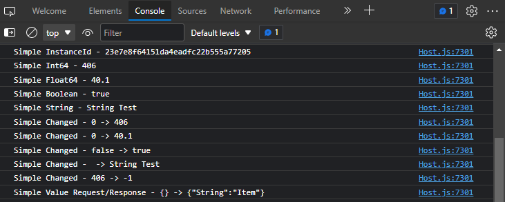

## Simple Interop Example for DIRECT 7.2

This is an example interop that shows how to run native code using a simple JavaScript object.

> **Note**
> Please use the branch corresponding to your version of DIRECT.

### Contents

* js/Simple.js - JavaScript class
* js/SimpleExample.js - JavaScript example
* lib/interop - DIRECT interop interface
* mac - macOS specific files
* linux - Linux specific files
* windows - Windows specific files

### Requirements

* CMake 3.15

### Build Instructions

Fetch submodules using Git:

```bash
git submodule update --init
```

CMake is a makefile generator that produces solutions and project files for various compiler toolkits. To generate the solution files for your environment and to build the project:

```bash
cmake -S . -B build
cmake --build build --config Debug
```

The target architecture of the shared library must match the architecture of the DIRECT client you are using. For example, if you are using host.exe for 32-bit Windows, then you must configure for x86 by using CMake argument `-A Win32`. If configuring on Windows, it is recommended that you statically link against MSVC runtime using `-D CMAKE_MSVC_RUNTIME_LIBRARY=MultiThreaded` to prevent the user from having to install the Visual C++ runtime separately. To build on macOS, using Xcode, supply the `-G Xcode` argument.

### Setup Instructions

First copy the shared library to the directory where you intended to load it from. In our steps below we use the same directory as the client's executable: `{moduleAppDirectory}`.

### JavaScript Integration

If you intend to use the interop with-in JavaScript use the following steps:

1. Copy `Simple.js` and `SimpleExample.js` from the `js` directory to a directory in your skin called `src/interop`.
2. Load the example code and interop in `/src/App.jsx` using `app.loadInterop`:
    ```js
    import "./interop/SimpleExample.js";

    const simplePath = app.expandString("{moduleAppDirectory}{libraryPrefix}simple.{libraryExtension}");
    app.loadInterop("simple", simplePath);
    ```
3. Call `app.unloadInterop` before `skinWindow.close()` in `src/App.jsx`:
    ```js
    app.unloadInterop("simple", simplePath);
    ``` 
3. Run `host` application with `--devtools --disablesecurity` (during production if you sign the dll you won't need this).
4. If it integrated properly, you will see the following lines in console window. <br/>
